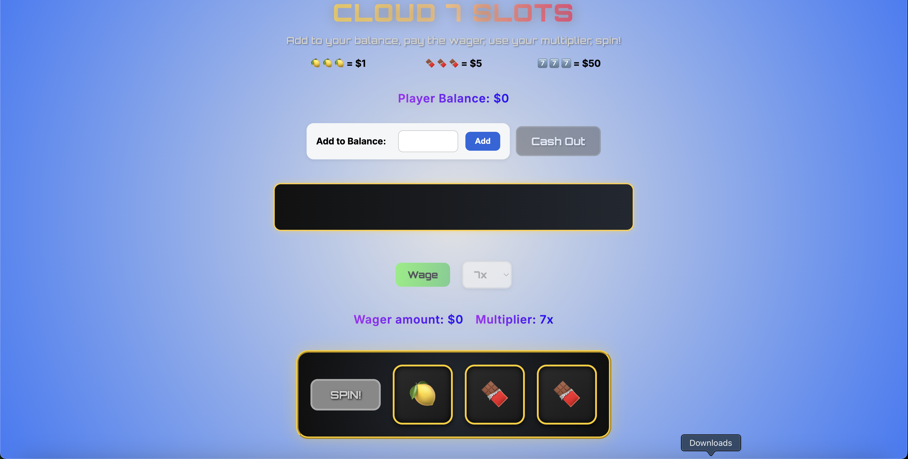

# Aurify Project

Welcome to my slot machine project! This is a slot machine game that I developed using React.

## Technologies Used
1. React
2. Docker

## Running the Project

### Step 1: Installation and Confirmation

Having Docker/Docker Desktop is essential. In order to download docker, please
follow this link to download docker: [Docker Download](https://docs.docker.com/get-started/get-docker/)

For confirmation of docker download, please type the following commands into your 
terminal/cmd prompt:
```
docker version
docker system info
```
From these commands you should see output that shows information about Docker:
```commandline
Client:
 Version:           27.4.0
 API version:       1.47
 Go version:        go1.22.10
 Git commit:        bde2b89
 Built:             Sat Dec  7 10:35:43 2024
 OS/Arch:           darwin/arm64
 Context:           desktop-linux
```

### Step 2: Running Docker

Now traverse to the slot-machine project directory via terminal/command prompt (command: cd ./slot-machine). In the directory, a file named "Dockerfile" is located there. **First**, ensure Docker Desktop is running. Then, run the commands (separately):

```commandline
docker build -t slot-machine-app:dev .

docker run -p 5173:5173 slot-machine-app:dev
```
From there you should see an output similar to this:

```commandline    
(base) nickhuang@Mac slot-machine % docker build -t slot-machine-app:dev .
[+] Building 2.9s (10/10) FINISHED                         docker:desktop-linux
 => [internal] load build definition from Dockerfile                       0.0s
 => => transferring dockerfile: 197B                                       0.0s
 => [internal] load metadata for docker.io/library/node:20-alpine          2.3s
 => [internal] load .dockerignore                                          0.0s
 => => transferring context: 90B                                           0.0s
 => [1/5] FROM docker.io/library/node:20-alpine@sha256:fa316946c0cb1f041f  0.0s
 => => resolve docker.io/library/node:20-alpine@sha256:fa316946c0cb1f041f  0.0s
 => [internal] load build context                                          0.0s
 => => transferring context: 17.13kB                                       0.0s
 => CACHED [2/5] WORKDIR /app                                              0.0s

```
```commandline
(base) nickhuang@Mac slot-machine % docker run -p 5173:5173 slot-machine-app:dev

> slot-machine@0.0.0 dev
> vite --host 0.0.0.0


  VITE v7.0.4  ready in 110 ms

  ➜  Local:   http://localhost:5173/
  ➜  Network: http://172.17.0.2:5173/
```

### Step 3: Accessing the Web Page and Working with the Service

Once the web application is up and running. You can access the game page by going to your local browser and typing:
```
http://localhost:5173/
```
This will bring you to the game page, which should look something like this:


### Step 4: How to Play the Game
1. Add to your balance (any amount you please)

**Note:** You must have money in your starting balance to play the game.

2. Press the **Wage** Button to enter in $1

3. (If desired) Use the dropdown to include a multiplier. The multiplier goes up to 10x.

4. Press the **Spin** Button to generate your results

5. Collect your money in your balance!
**Note:** Winning will generate a message in the game status box right above the Wage/Multiplier Buttons

6. Cash out anytime, this will return the player balance back to 0 and display the total money you walk out with.

## Supplementary Tasks

1. I implemented a multiplier in the game to allow users to go beyond the $1 buy-in mark. The max multiplier mark is 10x.

2. Every 3 rounds, the user is granted a $10 bonus to keep on playing. 

**Reason:** Even though I value music, ease of gameplay, and other factors in the attractiveness of a game, I believe money is the number one motivator for someone playing a slot machine game. Being able to give a reward for participation will cause the user to stay. 

## Bugs and Limitations

1. When confetti falls for winning, if the user decides to choose a different multiplier, this may cause the game status displayed amount to change with it. 

**Important:** This will not change the player's balance.

2. If the user spams the Wage and Spin Buttons, the messages may lag behind. This is due to the fact that there is a timer for how long the message stays on the game status board

3. Refreshing the page will cause everything to reset. This is a web application, so the state of the user will not persist through refreshes.

## Future Improvements
### 1. Spinning animations for the slot resuls
Suspense is a huge part of gambling. I would've implemented a mechanism where the slot results are shown in succession, so the user can see the first 2 results before the last. I missed that excitement factor

### 2. More rounds to obtain bonus money
Due to testing purposes, I made it 3 rounds before a user gets the bonus $10. If this were in production, I would've made it 15 to 20.

### 3. Unlimited Multiplier
Looking back, I would've made the multiplier a number input rather than a dropdown, so the users who are feeling super lucky can reach their limits.